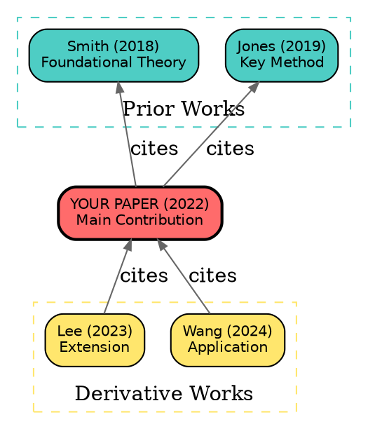

# Citation Graph Format Reference

## Graphviz DOT Format

The primary format for static citation graph visualization.

### Basic Structure


### Advanced Styling
```dot
// Node sizing by citation count
"paper1" [width=2.0, height=1.0, fillcolor="#4ECDC4"];  // Highly cited
"paper2" [width=1.0, height=0.5, fillcolor="#4ECDC4"];  // Low cited

// Edge styling for influential citations
"target" -> "prior1" [penwidth=2.0, color="#FF0000", label="influential"];

// Temporal coloring
// Blue = pre-2020, Green = 2020-2022, Orange = 2023+
```

## JSON Graph Format

For programmatic processing and D3.js visualization.

```json
{
  "nodes": [
    {
      "id": "paper_abc123",
      "label": "Smith (2022) Title",
      "type": "target",
      "year": 2022,
      "citations": 150,
      "influential": true,
      "doi": "10.1234/abc"
    },
    {
      "id": "paper_def456",
      "label": "Jones (2019) Prior Work",
      "type": "prior",
      "year": 2019,
      "citations": 500,
      "influential": true
    }
  ],
  "edges": [
    {
      "source": "paper_abc123",
      "target": "paper_def456",
      "type": "cites",
      "influential": true,
      "contexts": ["The authors build on Jones' framework..."]
    }
  ],
  "metadata": {
    "seed_paper": "paper_abc123",
    "depth": 1,
    "total_nodes": 50,
    "total_edges": 75,
    "generated": "2024-01-15T10:30:00Z"
  }
}
```

## GEXF Format (Gephi)

For use with Gephi network analysis software.

```xml
<?xml version="1.0" encoding="UTF-8"?>
<gexf xmlns="http://www.gexf.net/1.3" version="1.3">
  <meta>
    <creator>literature-research citation-graph skill</creator>
    <description>Citation network for [paper title]</description>
  </meta>
  <graph defaultedgetype="directed" mode="static">
    <attributes class="node" mode="static">
      <attribute id="0" title="year" type="integer"/>
      <attribute id="1" title="citations" type="integer"/>
      <attribute id="2" title="type" type="string"/>
    </attributes>
    <nodes>
      <node id="1" label="Smith (2022)">
        <attvalues>
          <attvalue for="0" value="2022"/>
          <attvalue for="1" value="150"/>
          <attvalue for="2" value="target"/>
        </attvalues>
      </node>
    </nodes>
    <edges>
      <edge id="e1" source="1" target="2" type="directed" label="cites"/>
    </edges>
  </graph>
</gexf>
```

## Rendering Commands

### Graphviz
```bash
# PNG output
dot -Tpng citation_graph.dot -o citation_graph.png

# SVG output (scalable)
dot -Tsvg citation_graph.dot -o citation_graph.svg

# PDF output
dot -Tpdf citation_graph.dot -o citation_graph.pdf

# With custom layout
neato -Tpng citation_graph.dot -o citation_graph.png  # Force-directed
fdp -Tpng citation_graph.dot -o citation_graph.png    # Force-directed placement
sfdp -Tpng citation_graph.dot -o citation_graph.png   # Scalable force-directed
```

### Python (NetworkX + Matplotlib)
```python
import networkx as nx
import matplotlib.pyplot as plt

G = nx.DiGraph()
G.add_edge("Target", "Prior A")
G.add_edge("Target", "Prior B")
G.add_edge("Deriv X", "Target")

pos = nx.spring_layout(G)
nx.draw(G, pos, with_labels=True, node_size=3000, node_color="lightblue",
        font_size=8, arrows=True, edge_color="gray")
plt.savefig("citation_graph.png", dpi=150, bbox_inches="tight")
```

## Node Size Scaling

Scale node size by citation count for visual impact:
```python
import math

def node_size(citations, min_size=500, max_size=5000):
    if citations <= 0:
        return min_size
    log_citations = math.log10(citations + 1)
    max_log = math.log10(10000)  # Cap at 10K citations
    scale = min(log_citations / max_log, 1.0)
    return min_size + (max_size - min_size) * scale
```
